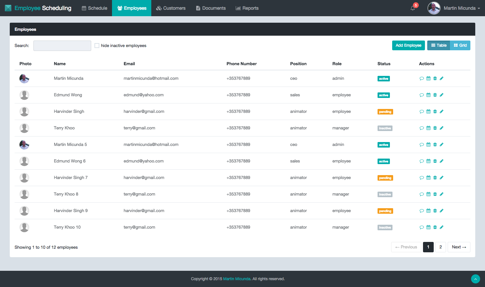

Employee Scheduling UI
======================

[](https://gitter.im/martinmicunda/employee-scheduling-ui?utm_source=badge&utm_medium=badge&utm_campaign=pr-badge&utm_content=badge)
[](http://travis-ci.org/martinmicunda/employee-scheduling-ui) [](https://ci.appveyor.com/project/martinmicunda/employee-scheduling-ui) [](https://david-dm.org/martinmicunda/employee-scheduling-ui#info=devDependencies) 

**Note: :warning: This project is under development.**

An UI component for [Employee Scheduling](https://github.com/martinmicunda/employee-scheduling) application. My talk from AngulaJS meetup in Dublin on "**How to start writing apps with ES6, AngularJS 1.x and JSPM**" can be found [here](http://martinmicunda.com/presentations/how-to-start-writing-apps-with-es6-angular-1x-and-jspm/how-to-start-writing-apps-with-es6-angular-1x-and-jspm.html#/).

## Demo
This demo is running from [gh-pages](https://github.com/martinmicunda/employee-scheduling-ui/tree/gh-pages) branch in backend-less development env (see [backend-less](#backend-less) section).

<a href="http://martinmicunda.github.io/employee-scheduling-ui/dist" target="_blank">Click here to see it in action!</a>



## Features
  * Use ES6 with Angular 1.x
  * Use ES6 Modules via [SystemJS](https://github.com/systemjs/systemjs) and [ES6 Module Loader Polyfill](https://github.com/ModuleLoader/es6-module-loader)
  * Use [ES7 decorators](https://github.com/wycats/javascript-decorators) to avoid Angular 1 boilerplate code
  * Manage development and production workflow with [JSPM](http://jspm.io/), [SystemJS builder](https://github.com/systemjs/builder) and [Gulp](http://gulpjs.com/)
  * Mocked Backend Workflow - help with mocking backend-less development
  * Achieve some of the Angular 2.0 goals while still running on Angular 1.x
  * Produce optimised, production ready code for deployment and automatically deploy this code to [gh-pages](https://github.com/martinmicunda/employee-scheduling-ui/tree/gh-pages) after each commit via [Travis CI](https://travis-ci.org/martinmicunda/employee-scheduling-ui)

##<a name="installation-and-configuration"></a> Installation & Configuration

###<a name="platform-and-tools"></a> Platform & Tools
You need to install Node.js and then the development tools. Node.js comes with a package manager called [npm](http://npmjs.org) (requires npm version >= 2.0.0 for this project) for installing NodeJS applications and libraries.

[Install Node.js](http://nodejs.org/download/) (requires node.js version >= 0.12.0)

###<a name="installation"></a> Installation

**1.** Clone or [fork](https://github.com/martinmicunda/employee-scheduling-ui/fork) this repository:
```bash
$ git clone git@github.com:martinmicunda/employee-scheduling-ui.git 
$ cd employee-scheduling-ui
```

**2.** Install local dependencies
```bash
$ npm install
```
> **Note:** Verify that all 3rd party dependencies from [package.json](package.json) are installed on your local machine. If you have followed the instructions and there have been no errors when executing the above commands, the dependencies should be installed.
     
## Directory Layout and File Structure

### Folder structure

#### Development
TODO: (martin) add folder development structure

#### Production
    build/               
      |- dist                       --> distribution source code that goes to production
      |  |- fonts/                     --> fonts
      |  |- images/                    --> image files
      |  |- scripts/                   --> js files 
      |  |  |- main.min-12345.js           --> concat, minify angular app js files and cached html templates      
      |  |- styles/                    --> css files 
      |     |- main.min-12345.css          --> concat & minify app css files 
      |  |- index.html                 --> app main file
      |- docs/                      --> app documentation   
           
## How to Run

### Development
When you're working on project with real back-end start with:

```bash
$ npm start 
```
> **NOTE:** The `npm start` task is alias for `npm start -- --env=DEV`.

This task will install all dependencies, build dev environment, monitor the source files, compile SASS to CSS and launch the browser. The task also includes [Browsersync](http://www.browsersync.io/), so you no longer have to manually refresh your page after making changes! Make sure `API_URL` constant in [`gulp/const.js`](gulp/const.js) file points to your API back-end.

If you don't want to launch the browser when serving code then pass `--open=false` flag:

```bash
$ npm start -- --open=false
```

### Test 
When you're working on project without real back-end start with:

```bash
$ npm start -- --env=TEST
```
> **NOTE:** This is really useful for backend-less testing in CI env or backend-less development if you don't have access to real back-end. Data from `fixtures` folders will be served.

If you want to run production optimized code with `fixtures` data start with: **TODO: (martin)** this task is not supported yet!
```bash
$ npm start -- --env=TEST --optimize=true
```
> **NOTE:** This produce optimized build like `--env=PROD` and also include `fixtures` data into bundle.

### Production
When you're working on project with real back-end and want to try production bundle start with:

```bash
$ npm start -- --env=PROD
```

> **NOTE:** This run against the code specify in `build/dist` folder. See [build](#build) section for more details how `build` is created.


## How to Test
TODO

##<a name="build"> How to Build
The build task get app ready for production. The build task include transpilation from ES6 to ES5, concatenation, minification, compression, asset revision, template cache, cdn etc. If there have been no errors when executing the build command, the build should be located in `build/dist` directory and this build is ready for uploading to the server! To initiate a full build, you simply run the follow task:
```bash
$ npm run build
```

If you want use CDN then add your CDN url to `CDN_URL` constant in [`gulp/const.js`](gulp/const.js) file and then run the build task with argument `--cdn` to replace local path with CDN url: 
```bash
$ npm run build -- --cdn
```

## How to Deploy
TODO

##Tips
```
# Maintenance 
npm update -g           #update all outdated global packages
npm update --save-dev   #update all outdated local packages (run from project directory) 
npm update npm -g       #self npm update
brew update && brew doctor
brew upgrade node       #update to latest node version
npm shrinkwrap --dev    #Lock down dependency versions 
```

## License

    Copyright (c) 2014-2015 Martin Micunda  

    Source code is open source and released under the GNU GPL v3 license.
